# 📌 Project Background 

Loan prediction is a real-world problem that many individuals face, especially for students who are going to graduate and are entering the workforce. They may need loans for various purposes, such as buying a car, securing housing, or furthering their education. Understanding the likelihood of loan approval is also crucial for them. Our report results could provide valuable insights and help individuals make informed decisions about their financial future.

Our project questions include:   
- Which features play a significant role in determining housing price classification?
- Which machine learning algorithms are best for our analysis?
- What business implications do our findings have? 

<i>In collaboration with Angel Sheu, Tracey Liu, and Lisa Rumao.</i>  

# ✨ Data Overview
- Source: [Dataset](https://www.kaggle.com/datasets/yashpaloswal/loan-prediction-with-3-problem-statement) from Kaggle.
- Size: There are 981 observations and 11 columns in the dataset.
- Demographic Features: Analyzed categorical columns like gender, marital status, dependent status, educational status, property area, credit history, and loan amount term.
- Numerical Features: Examined numerical columns such as applicant income, co-applicant income, and loan amount.

# 📊 Exploratory Data Analysis     
    
      
      
-  
    
      
      
- Property area is categorized as Urban, Semi-Urban, or Rural.
    
      
      
- Credit history is a binary indicator (1: Good, 0: Bad)
    
      
    

These features contribute to a holistic understanding of applicants' backgrounds and financial capacities, laying the foundation for building an effective predictive model.

# 🔍 Benchmark 
We have carried out three machine-learning models: 
1. Decision Trees
2. Logistic Regression
3. Random Forest

Each model has its benchmark, which we will present in the analysis step.

The chart demonstrates the evaluation metrics for these three models.

The performance of each model is measured based on 
- Test Accuracy
- Test F1 Score
- Loan Acceptance Ratio
- Loan Rejection Ratio.
    
      
      

# 🧽 Data Cleaning  (Todo)
### Logistic Regression
1. Change categorical variables into dummy variables & replace target variable with 0,1
    
      
    
2. Deleting the Missing Values
3. Standardized data
    
      
    
### Random Forest
1. Pre-pruning (mode): Implement pre-pruning techniques to avoid overfitting
    
      
    
    
      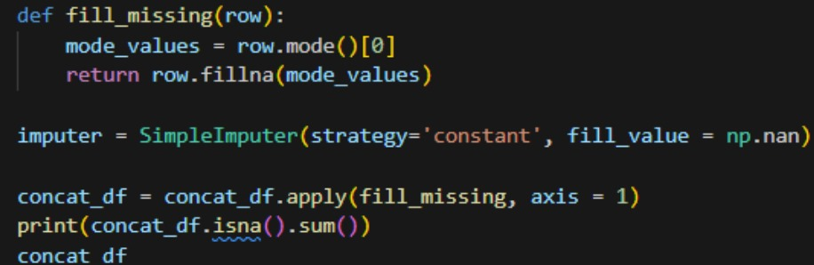
    
2. Delete missing values: The rows decreased from 981 to 765
    
      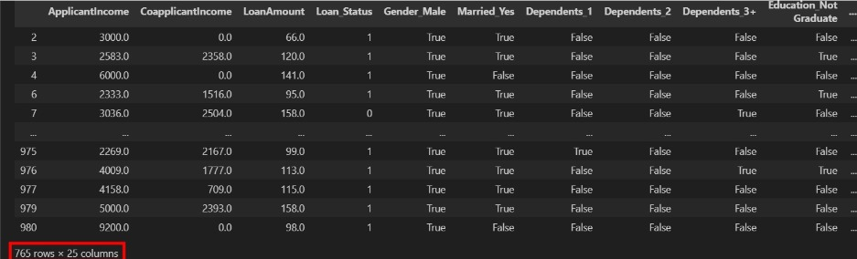
    
3. We scale the data to investigate whether inconsistencies in the data's magnitude would impact accuracy and F1 score.
    
      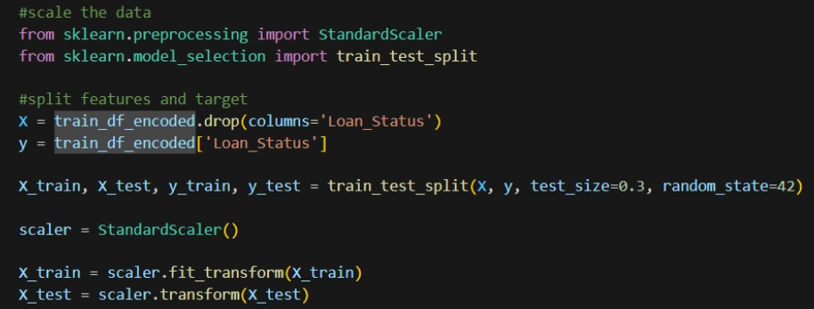
    
### Decision Trees
1. Removed all of the missing values, and replaced missing values with mode
    
      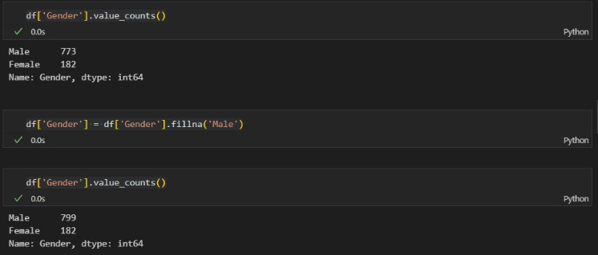
    
3. Replaced missing values with mode and mean
    
      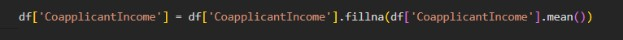
    

# ✏️ Machine Learning Models  
### Logistic Regression

- We ran logistic regression with the cleaned data, which replaced NaN values with mode values and set the benchmarks 
    
      
    
    
      
    
- We also tried replacing categorical NaN values with mode values and numerical NaN values with the mean.
    
      
    
    
      
    
- Testing Different Parameters
  In the final process, we tested different parameters, such as the threshold, solver, and penalty, to find the best accuracy. To limit irrelevant coefficients, we chose Lasso Regularization to prevent overfitting and encourage sparsity in the model.
   
      
   
- We used GridSearchCV with CrossValidation to determine the best hyperparameters, and it turns out LogisticRegression(C=0.01, random_state=42, solver='liblinear') is the best parameter for the model. Eventually, we got the testing accuracy at 92%, and the F1 score was 95%
   
      
   

Our model assesses the accuracy threshold and F1 score for both the training and testing sets, producing a clear chart. After analyzing the decision threshold chart, we chose a threshold of 0.5 as it corresponds to the highest testing accuracy.
    
      
   

After fitting the logistic regression model with the L1 penalty, we inspect which variables have been set to zero (effectively deleted) by examining the coefficients of the model. 

Eventually, the model excluded all categorical variables and only kept numerical ones after implementing the L1 penalty.

In conclusion, the two methods that improved testing accuracy the most were removing missing values and applying L1 regularization. 

To determine whether to authorize the loans or not, we must still build a cost-benefit matrix and account for the costs associated with type 1 and type 2 errors because loan prediction is more closely tied to the expected value framework.

<b>📈 Logistic regression accuracy chart:
</b>
   
      
   
   
### Random Forest
- We ran Random Forest with the cleaned data, which replaced NaN values with mode values and set the benchmarks 
    
      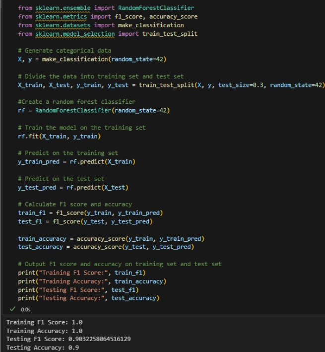
    
- Then we used cross-validation
    
      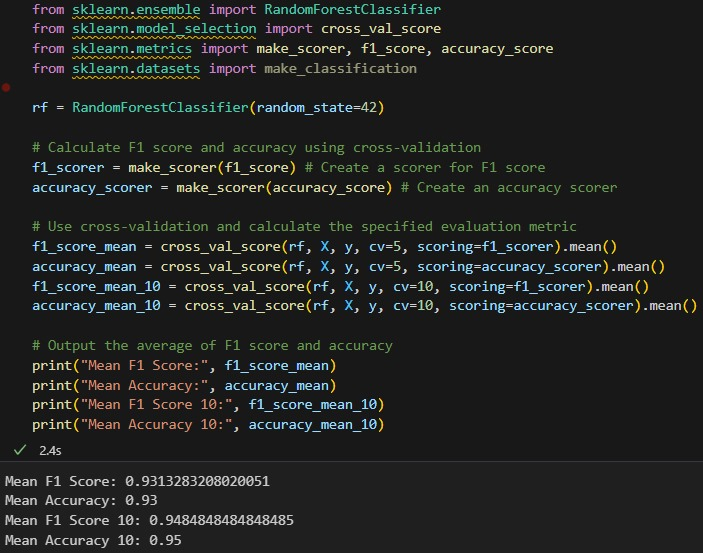
    
- We adjusted the parameters.
    
      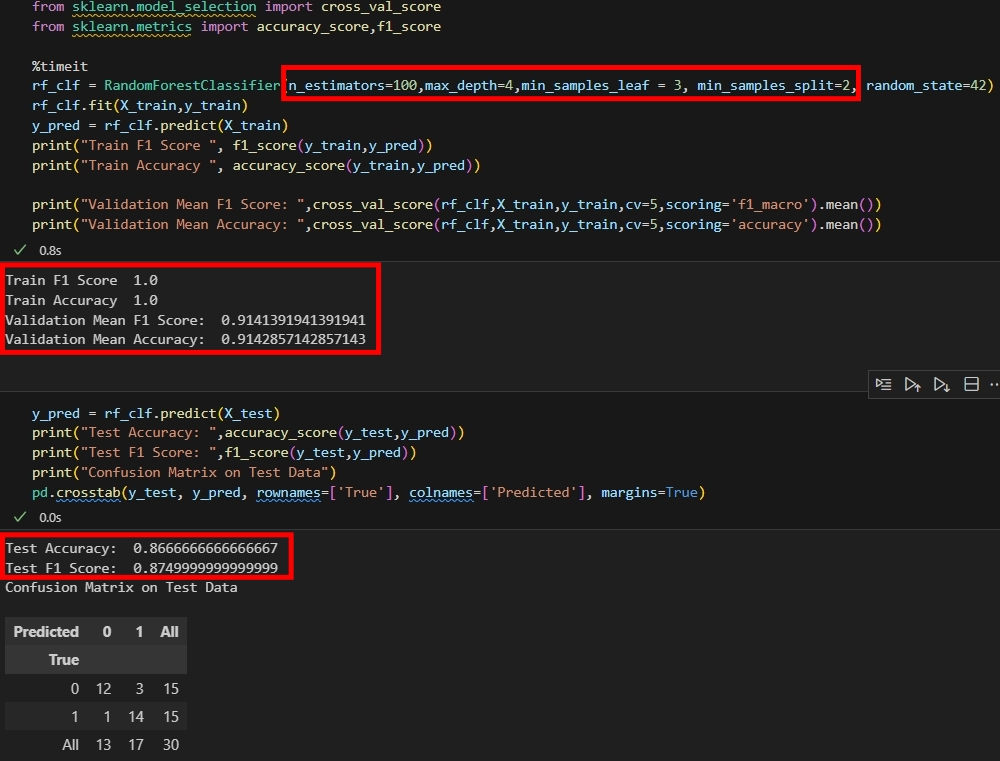
    
- Adjusted some parameters, which helped reduce overfitting and, in turn, improved the accuracy and F1 score on the test set.
    
      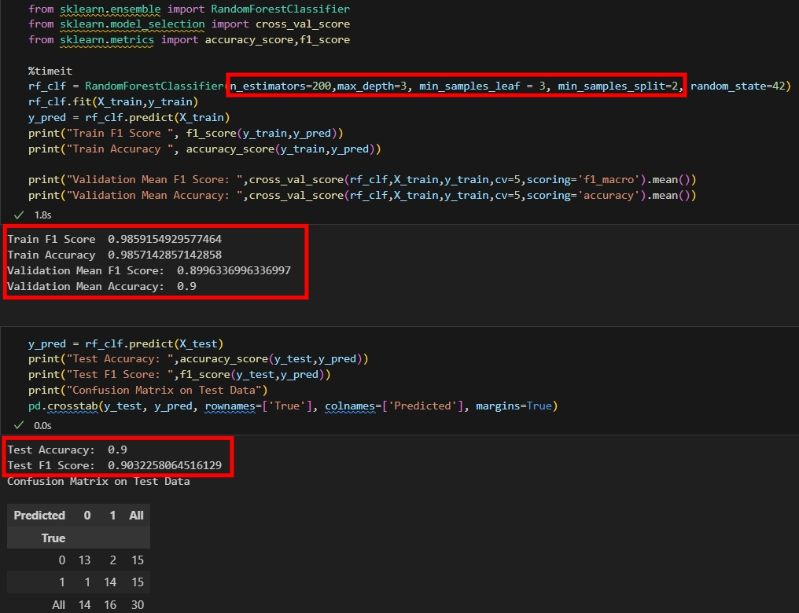
    
- Employ GridSearchCV to systematically test and tune different parameters.
    
      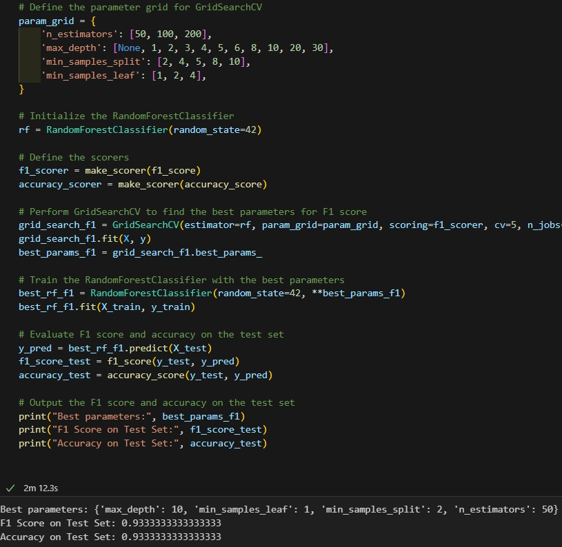
    

- In the final process, we tested different parameters, such as the n_estimators, max_depth, and min_samples_split on our own, to find the best accuracy.
   
      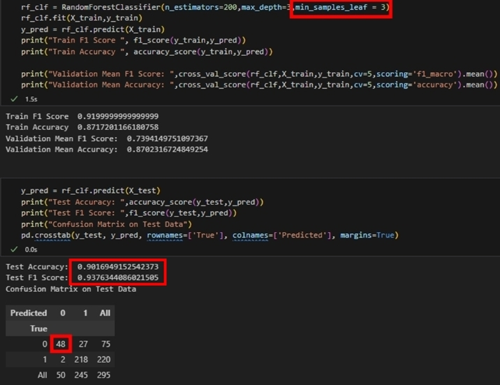
    

In summary, the Random Forest model performed well when employing GridSearchCV and testing various parameters on our own, exhibiting significant improvements in accuracy and achieving the best F1 score on the test set.
<b>📈 Random Forest accuracy chart:
   
      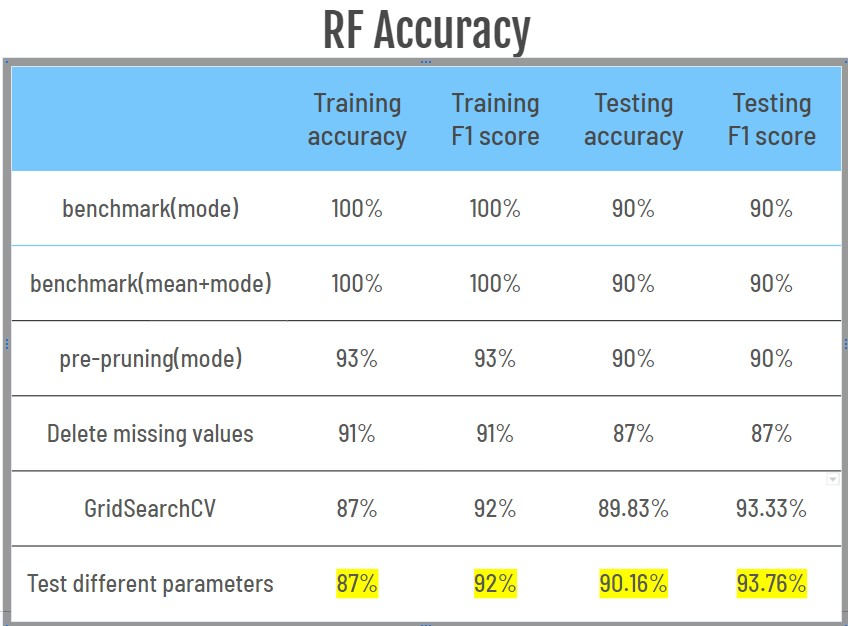
   
</b>
### Decision Trees
- Initially, we transformed the categorical columns. We ran the decision tree model without adding NaN, and the results showed that our benchmark was 0.86 for testing accuracy, 0.92 for testing F1 score, 0.89 for training accuracy, and 0.93 for training F1 score.
   
      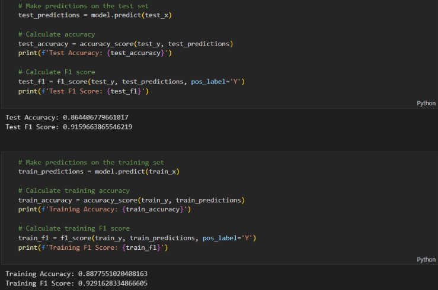
   

- We did pre-processing, split=.3, (max_depth, min_samples_leaf) = (3, 3)
   
      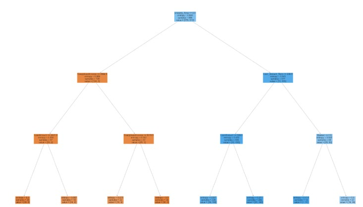
   

- Missing values replaced with mode, split=.3, (max_depth, min_samples_leaf) = (4, 4)
   
      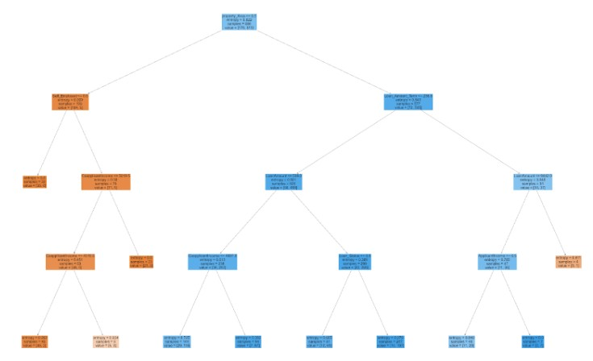
   
  
- Missing values replaced with mode and mean, split=.3, (max_depth, min_samples_leaf) = (3, 3)
   
      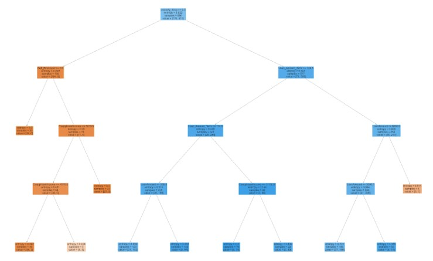
   

Overall, the highest testing accuracy was 0.92, the testing F1 score was 0.95, the training accuracy was 0.87, and the training F1 score was 0.92
<b>📈 Decision Trees accuracy chart:
   
      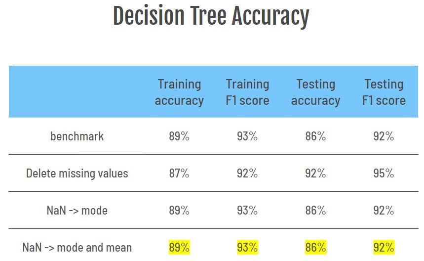
   
</b>
# 🔑 Key Takeaways    
The performance of the Logistic Regression model remained steady across various methods, showcasing notable advancements, particularly when leveraging GridSearchCV for parameter optimization.

While the Random Forest model demonstrated enhanced accuracy through techniques like pre-pruning and parameter testing, the impact of the 'Delete missing values' method was moderate.

In contrast, the Decision Tree model displayed consistent performance regardless of the method employed.

In conclusion, for maximizing model performance, Logistic Regression exhibited superior results, especially when fine-tuning parameters, closely trailed by the Random Forest model. The Decision Tree model did not substantially improve accuracy following the 'Delete missing values' method.

# ☁️ Project Improvements  
1. Feature Engineering:
Enhance the predictive power of the models by creating new features from the existing data. For example, interaction terms between numerical features or aggregating features that can capture more complex relationships within the data. This could include ratios like the loan amount to applicant income, or new binary indicators for specific thresholds in income or loan amount.

2. Handling Missing Values:
Instead of simply deleting rows with missing values or using basic imputation techniques, apply advanced imputation methods like K-Nearest Neighbors (KNN) imputation, or model-based imputation. These methods can better estimate missing values based on the relationships between features, potentially improving model performance.

3. Algorithm Tuning and Ensemble Methods:
Further tune the hyperparameters of the models using more sophisticated techniques such as Bayesian Optimization or Genetic Algorithms. Additionally, consider ensemble methods that combine multiple models, such as Gradient Boosting Machines (GBM) or Stacking, to potentially increase accuracy and robustness.

 
